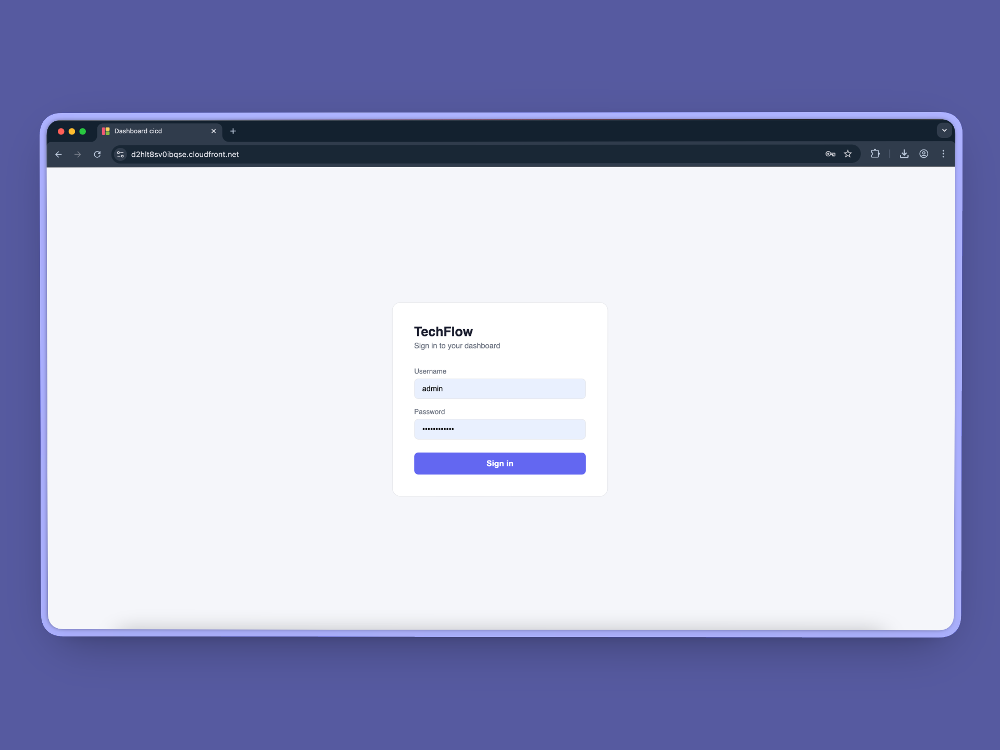
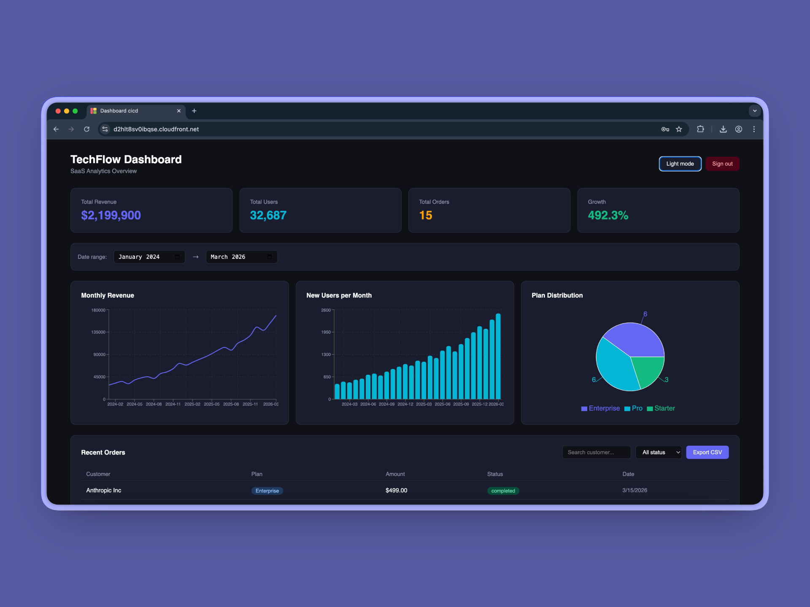
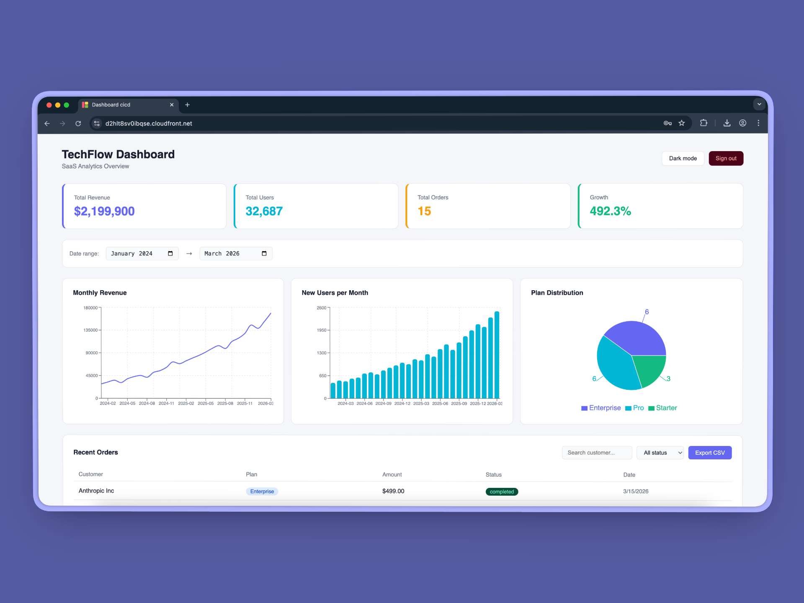
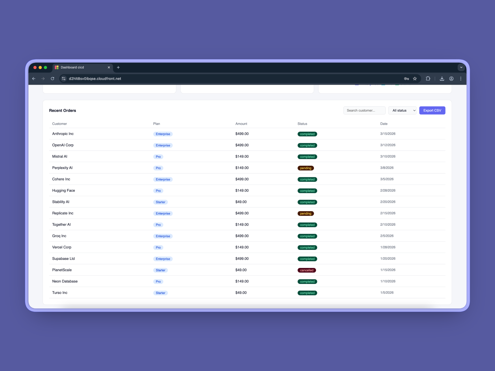
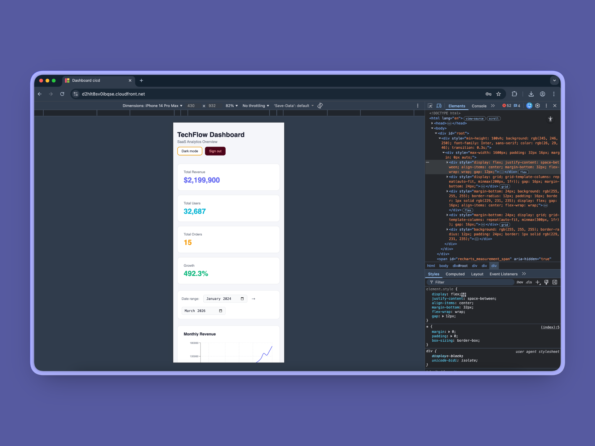
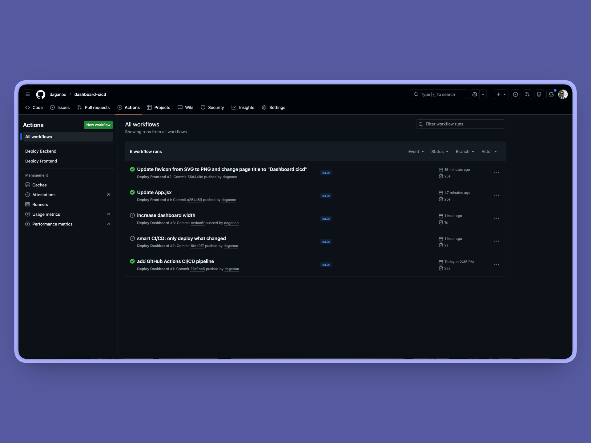

# ◆ TechFlow Dashboard — React + AWS CI/CD Pipeline

> A full-stack SaaS analytics dashboard with automated CI/CD pipeline. Every code push automatically builds and deploys to production. React frontend served via CloudFront CDN, Node.js REST API on EC2, PostgreSQL database on RDS.

---

## 📸 Screenshots

| Login | Dashboard (Dark) |
|-------|-----------------|
|  |  |

| Dashboard (Light) | Orders Table |
|-------------------|--------------|
|  |  |

| Mobile View | CI/CD Pipeline |
|-------------|----------------|
|  |  |

---

## ✨ Features

- **JWT Authentication** — Secure login with bcrypt password hashing and 8-hour token expiry
- **Real-time Analytics** — Revenue, users, and orders pulled live from PostgreSQL
- **Interactive Charts** — Line chart, bar chart, and donut chart powered by Recharts
- **Date Range Filter** — Filter all charts by custom date range
- **Orders Table** — Search, filter by status, and export to CSV
- **Dark/Light Mode** — Full theme toggle with smooth transitions
- **Skeleton Loading** — Professional loading states while data fetches
- **Responsive Layout** — Works on desktop, tablet, and mobile
- **Automated CI/CD** — Every `git push` auto-deploys frontend + backend via GitHub Actions
- **Zero Downtime** — PM2 process manager keeps API alive, auto-restarts on server reboot

---

## 🏗️ Architecture

```
User Browser
     ↓ HTTPS
CloudFront CDN          ← serves React app from S3
     ↓
React Dashboard         ← login, charts, orders table
     ↓ HTTPS
CloudFront (API)        ← wraps EC2 API with HTTPS
     ↓
EC2 + Node.js API       ← 6 REST endpoints, JWT auth
     ↓ SSL
RDS PostgreSQL          ← revenue, users, orders, admins
```

```
GitHub push
     ↓
GitHub Actions
     ↓              ↓
Frontend job     Backend job
(if frontend/    (if backend/
 changed)         changed)
     ↓              ↓
Build React      SSM command
npm run build    to EC2
     ↓              ↓
Upload to S3     git pull +
     ↓           npm install +
CloudFront       pm2 restart
invalidation
```

---

## 🛠️ Tech Stack

### AWS Services
| Service | Role | Why |
|---------|------|-----|
| **EC2** | Runs Node.js REST API | Full control over server environment |
| **RDS PostgreSQL** | Stores all dashboard data | Managed database, automatic backups |
| **S3** | Hosts compiled React frontend | Infinitely scalable static hosting |
| **CloudFront** | CDN + HTTPS for frontend and API | Global edge caching, free SSL certificate |
| **VPC** | Private network for EC2 + RDS | RDS never exposed to internet |
| **IAM** | Roles for EC2, GitHub Actions | Least-privilege access |
| **SSM** | Remote commands on EC2 | Secure deployment without SSH |
| **CloudWatch** | EC2 + API monitoring | Real-time logs and alarms |

### Backend
| Tool | Role |
|------|------|
| **Node.js 22** | API runtime |
| **Express** | REST API framework |
| **PostgreSQL (pg)** | Database driver |
| **JWT** | Authentication tokens |
| **bcryptjs** | Password hashing |
| **PM2** | Process manager — keeps API alive 24/7 |

### Frontend
| Tool | Role |
|------|------|
| **React 18** | UI framework |
| **Vite** | Build tool |
| **Recharts** | Charts — line, bar, pie |
| **CSS-in-JS** | Inline styles with dark/light theming |

### DevOps
| Tool | Role |
|------|------|
| **GitHub Actions** | CI/CD — auto-deploys on every push |
| **AWS CLI** | S3 sync, CloudFront invalidation |
| **SSM** | Secure EC2 deployment — no SSH needed |
| **PM2** | Auto-restart on server reboot |

---

## 📁 Project Structure

```
dashboard-cicd/
├── frontend/                    # React application
│   ├── src/
│   │   ├── App.jsx              # Main dashboard — all UI + API calls
│   │   ├── Skeleton.jsx         # Loading skeleton component
│   │   └── main.jsx             # React entry point
│   ├── index.html
│   ├── vite.config.js
│   └── package.json
│
├── backend/                     # Node.js REST API
│   ├── index.js                 # Express server — 6 endpoints
│   ├── createAdmin.js           # One-time admin user setup
│   ├── .env                     # Environment variables (not committed)
│   └── package.json
│
├── .github/
│   └── workflows/
│       ├── deploy-frontend.yml  # Auto-deploy frontend on frontend/ changes
│       └── deploy-backend.yml   # Auto-deploy backend on backend/ changes
│
├── docs/
│   └── screenshots/             # Portfolio screenshots
│
├── .gitignore
└── README.md
```

---

## 🔌 API Reference

### POST `/api/login`
Authenticate and receive JWT token.

**Request:**
```json
{
  "username": "admin",
  "password": "your_password"
}
```

**Response:**
```json
{
  "token": "eyJhbGciOiJIUzI1NiIsInR5cCI6IkpXVCJ9..."
}
```

---

### GET `/api/stats`
Get summary numbers for the 4 stat cards.

**Headers:** `Authorization: Bearer <token>`

**Response:**
```json
{
  "totalRevenue": "467100.00",
  "totalUsers": "5552",
  "totalOrders": "25",
  "growth": "413.4"
}
```

---

### GET `/api/revenue`
Get monthly revenue data for the line chart.

**Headers:** `Authorization: Bearer <token>`

**Response:**
```json
[
  { "month": "2024-01", "amount": "28500.00" },
  { "month": "2024-02", "amount": "32200.00" }
]
```

---

### GET `/api/users`
Get monthly new users data for the bar chart.

**Headers:** `Authorization: Bearer <token>`

**Response:**
```json
[
  { "month": "2024-01", "new_users": 445 },
  { "month": "2024-02", "new_users": 510 }
]
```

---

### GET `/api/orders`
Get last 15 orders for the orders table.

**Headers:** `Authorization: Bearer <token>`

**Response:**
```json
[
  {
    "id": 1,
    "customer_name": "Anthropic Inc",
    "plan": "Enterprise",
    "amount": "499.00",
    "status": "completed",
    "created_at": "2026-03-15T00:00:00.000Z"
  }
]
```

---

### GET `/health`
Check if the API server is running.

**Response:**
```json
{ "status": "ok", "message": "API is running" }
```

---

## 🗄️ Database Schema

```sql
-- Monthly revenue data (powers line chart)
CREATE TABLE revenue (
  id SERIAL PRIMARY KEY,
  month VARCHAR(7) NOT NULL,
  amount DECIMAL(10,2) NOT NULL
);

-- Monthly new user signups (powers bar chart)
CREATE TABLE users (
  id SERIAL PRIMARY KEY,
  month VARCHAR(7) NOT NULL,
  new_users INTEGER NOT NULL
);

-- Individual orders (powers orders table)
CREATE TABLE orders (
  id SERIAL PRIMARY KEY,
  customer_name VARCHAR(100) NOT NULL,
  plan VARCHAR(50) NOT NULL,
  amount DECIMAL(10,2) NOT NULL,
  status VARCHAR(20) NOT NULL,
  created_at TIMESTAMP DEFAULT NOW()
);

-- Dashboard admin users (powers JWT auth)
CREATE TABLE admins (
  id SERIAL PRIMARY KEY,
  username VARCHAR(50) UNIQUE NOT NULL,
  password_hash VARCHAR(255) NOT NULL,
  created_at TIMESTAMP DEFAULT NOW()
);
```

---

## 🚀 Deploy Your Own

### Prerequisites
- AWS Account with CLI configured (`aws configure`)
- Node.js 22+
- Git

### Step 1 — Clone & Install
```bash
git clone https://github.com/YOUR_USERNAME/dashboard-cicd.git
cd dashboard-cicd

cd backend && npm install
cd ../frontend && npm install
```

### Step 2 — Configure Environment Variables
Create `backend/.env`:
```
PORT=5000
DB_HOST=your-rds-endpoint.rds.amazonaws.com
DB_PORT=5432
DB_NAME=dashboarddb
DB_USER=postgres
DB_PASSWORD=your_password
JWT_SECRET=your_jwt_secret
```

Create `frontend/.env`:
```
VITE_API_URL=https://your-cloudfront-api-url.cloudfront.net
```

### Step 3 — Create Admin User
```bash
cd backend
node createAdmin.js
```

### Step 4 — Deploy Backend to EC2
```bash
ssh -i ~/.ssh/your-key.pem ubuntu@YOUR_EC2_IP
git clone https://github.com/YOUR_USERNAME/dashboard-cicd.git
cd dashboard-cicd/backend
npm install
pm2 start index.js --name dashboard-api
pm2 startup && pm2 save
```

### Step 5 — Deploy Frontend to S3
```bash
cd frontend
npm run build
aws s3 sync dist/ s3://YOUR_BUCKET_NAME --delete
aws cloudfront create-invalidation --distribution-id YOUR_CF_ID --paths "/*"
```

### Step 6 — Setup CI/CD (GitHub Actions)
Add these secrets to your GitHub repo → Settings → Secrets → Actions:

| Secret | Value |
|--------|-------|
| `AWS_ACCESS_KEY_ID` | Your AWS access key |
| `AWS_SECRET_ACCESS_KEY` | Your AWS secret key |

Now every `git push` to `main` auto-deploys:
- Frontend changes → S3 + CloudFront invalidation ✅
- Backend changes → EC2 via SSM ✅

---

## 💰 Cost Breakdown

| Service | Free Tier | Estimated Monthly Cost |
|---------|-----------|----------------------|
| EC2 t2.micro | 750 hours/month free (12 months) | ~$0.00 first year |
| RDS db.t3.micro | 750 hours/month free (12 months) | ~$0.00 first year |
| S3 | 5GB free | ~$0.00 |
| CloudFront | 1TB transfer free | ~$0.00 |
| **Total** | | **~$0.00 first year** |

> After free tier expires: ~$15-20/month for EC2 + RDS

---

## 🧠 Key Technical Decisions

**Why EC2 instead of Lambda?**
EC2 gives full control over the Node.js environment, persistent connections to RDS, and is more representative of real-world production deployments that freelance clients run.

**Why CloudFront in front of EC2 API?**
EC2 only serves HTTP. The React frontend is served over HTTPS via CloudFront, and browsers block HTTP API calls from HTTPS pages (mixed content). Adding a second CloudFront distribution in front of the EC2 API solves this without needing a domain name or SSL certificate on the server.

**Why GitHub Actions instead of AWS CodePipeline?**
GitHub Actions is simpler to configure, free, and more widely used across the industry. The `paths` filter means only the relevant job runs on each push — frontend changes only trigger the frontend job, backend changes only trigger the backend job.

**Why SSM instead of SSH for deployments?**
SSM (Systems Manager) allows running shell commands on EC2 without opening port 22 or storing the `.pem` key in GitHub secrets. More secure and no key management needed.

**Why JWT with 8-hour expiry?**
Short token expiry limits the damage if a token is stolen. The React app automatically clears expired tokens and redirects to the login page, providing a seamless user experience.

---

## 🗑️ Teardown

To delete everything and stop all AWS charges:

```bash
# Terminate EC2 instance
aws ec2 terminate-instances --instance-ids YOUR_INSTANCE_ID --region eu-west-3

# Delete RDS database
aws rds delete-db-instance \
  --db-instance-identifier dashboard-db \
  --skip-final-snapshot \
  --region eu-west-3

# Empty and delete S3 buckets
aws s3 rm s3://dashboard-cicd-frontend --recursive
aws s3api delete-bucket --bucket dashboard-cicd-frontend --region eu-west-3

# Delete CloudFront distributions
aws cloudfront delete-distribution --id YOUR_FRONTEND_CF_ID --if-match YOUR_ETAG
aws cloudfront delete-distribution --id YOUR_API_CF_ID --if-match YOUR_ETAG

# Delete VPC and networking
aws ec2 delete-vpc --vpc-id YOUR_VPC_ID --region eu-west-3
```

---

## 👨‍💻 Author

Built by **Marouane Dagana** — Full Stack & Cloud Developer

- 🐙 GitHub: [@daganoo](https://github.com/daganoo)
- 💼 LinkedIn: [Marouane Dagana](https://www.linkedin.com/in/marouane-dagana-418832264/)

---

## 📄 License

MIT License — feel free to use this project as a template for your own work.